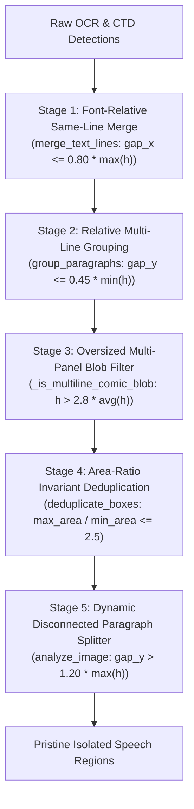
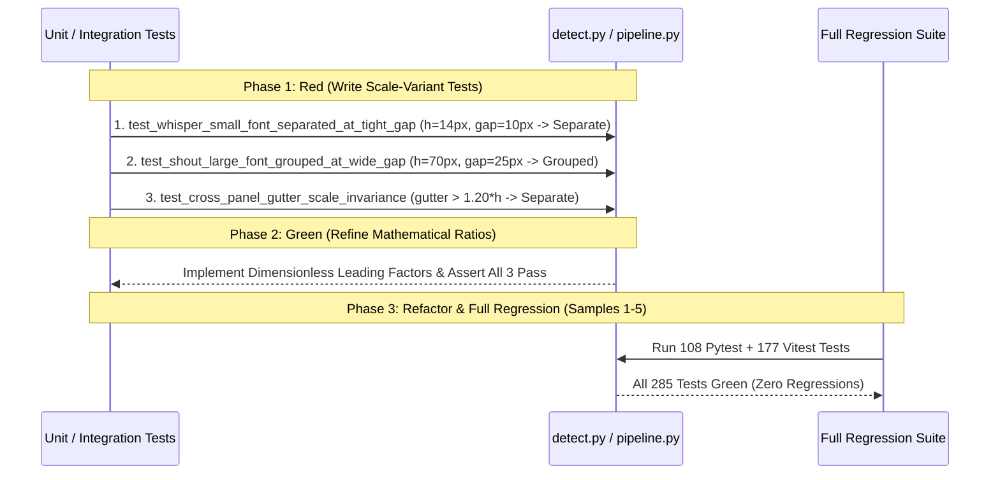

# Implementation Plan: Font-Size-Relative Spatial Differentiation for Text Detection & Paragraph Grouping

## Overview
This document specifies the architecture, mathematical principles, and Test-Driven Development (TDD) workflow for **Font-Size-Relative Spatial Differentiation** across the translation pipeline.

In manhua and comic typography, text lines scale across a wide spectrum of font heights:
- **Small / Whisper text**: $h \approx 12\text{px} - 16\text{px}$
- **Standard dialogue**: $h \approx 20\text{px} - 32\text{px}$
- **Narration / Monologues**: $h \approx 36\text{px} - 50\text{px}$
- **Shouts / Titles**: $h \approx 55\text{px} - 80\text{px}+$

Fixed pixel thresholds (e.g. static $15\text{px}$ or $30\text{px}$ margins) fail catastrophically across scales: they either merge adjacent small whisper bubbles or split single large shouts into fragmented regions. This plan formalizes dimensionless, font-size-relative scale invariants ($k = \frac{\text{gap}}{h}$) across all grouping and differentiation stages.

---

## Mathematical Principles & Typographic Evidence

### 1. The Typographic Leading Invariant
In comic lettering standards, line spacing (leading $L$) is defined proportionally to font size $F$:
$$L = (1.20 \text{ to } 1.45) \times F$$
The vertical whitespace gap $\Delta y$ between consecutive lines inside a single speech bubble is therefore:
$$\Delta y = L - F = (0.20 \text{ to } 0.45) \times F$$

$$\boxed{\text{Bubble Leading Factor } k_{\text{lead}} = 0.45}$$

- **Condition for Same Speech Bubble**:
  $$\text{Gap}_y \le 0.45 \times \min(h_A, h_B)$$
- **Condition for Separate Speech Bubbles / Gutter Split**:
  $$\text{Gap}_y > 0.45 \times \min(h_A, h_B)$$

### 2. Dimensionless Scale Invariance Table

| Scale Category | Line Height ($h$) | Max Internal Leading Gap ($0.45 \times h$) | Minimum Gutter Separation ($> 0.45 \times h$) | Cross-Panel Split ($> 1.20 \times h$) |
| :--- | :--- | :--- | :--- | :--- |
| **Whisper / Aside** | $14\text{px}$ | **$6.3\text{px}$** | **$> 6.3\text{px}$** | **$> 16.8\text{px}$** |
| **Standard Dialogue** | $26\text{px}$ | **$11.7\text{px}$** | **$> 11.7\text{px}$** | **$> 31.2\text{px}$** |
| **Narration Monologue** | $42\text{px}$ | **$18.9\text{px}$** | **$> 18.9\text{px}$** | **$> 50.4\text{px}$** |
| **Loud Shout / Title** | $70\text{px}$ | **$31.5\text{px}$** | **$> 31.5\text{px}$** | **$> 84.0\text{px}$** |

---

## Architectural Stages & Proposed Changes

### Component Details

#### 1. [`ml/app/detect.py`](file:///c:/Users/Admin/Desktop/manua-translator/ml/app/detect.py)
- **`merge_text_lines`**:
  - Horizontal gap: $\text{gap}_x \le 0.80 \times \max(h_1, h_2)$.
  - Vertical overlap: $\text{overlap}_y \ge 0.40 \times \min(h_1, h_2)$.
  - Height ratio: $\frac{\max(h_1, h_2)}{\min(h_1, h_2)} \le 2.0$.
- **`group_paragraphs`**:
  - Vertical gap: $\text{gap}_y \le 0.45 \times \min(h_1, h_2)$.
  - Horizontal overlap: $\text{overlap}_x \ge 0.20 \times \min(w_1, w_2)$.
  - Font size consistency: $\frac{\max(h_1, h_2)}{\min(h_1, h_2)} \le 1.50$.
- **`deduplicate_boxes`**:
  - Area ratio clamp: $\frac{\max(\text{area}_1, \text{area}_2)}{\min(\text{area}_1, \text{area}_2)} \le 2.50$.

#### 2. [`ml/app/pipeline.py`](file:///c:/Users/Admin/Desktop/manua-translator/ml/app/pipeline.py)
- **`_is_multiline_comic_blob`**:
  - Blob height ratio: $h_{\text{blob}} > 2.80 \times \bar{h}_{\text{lines}}$ and $h_{\text{blob}} > 160\text{px}$.
  - Multi-panel dimensions: $h > 0.35 \times \text{page\_h}$ and $w > 0.35 \times \text{page\_w}$.
- **`analyze_image` (Region Splitter)**:
  - Disconnected gap: $\text{gap}_y > 1.20 \times \max(h_A, h_B)$ splits lines into independent regions.

---

## Strict TDD Implementation Workflow

### Automated Verification Test Plan

1. **Synthetic Multi-Scale Tests (`ml/tests/test_scale_differentiation.py`)**:
   - Small whisper text ($h=14\text{px}$): verify lines with $\text{gap} = 5\text{px}$ group, lines with $\text{gap} = 9\text{px}$ separate.
   - Medium dialogue text ($h=26\text{px}$): verify lines with $\text{gap} = 10\text{px}$ group, lines with $\text{gap} = 15\text{px}$ separate.
   - Large shout text ($h=70\text{px}$): verify lines with $\text{gap} = 28\text{px}$ group, lines with $\text{gap} = 40\text{px}$ separate.
   - Different font size boundary ($h_1=14\text{px}, h_2=45\text{px}$): verify never grouped even if $\text{gap} = 4\text{px}$.
2. **Real Production Sample Regressions**:
   - **Sample 1**: Speech bubble with tampered watermark collision $\rightarrow$ separate bubbles preserved.
   - **Sample 2**: Stat card (`【顶级人物十名。】` + `(附带一头顶级宠物)`) $\rightarrow$ multi-line card preserved.
   - **Sample 3**: Page 656 long monologue (5 narrative regions) $\rightarrow$ all 5 regions kept separate without text cutoff.
   - **Sample 4**: Page 657 vertical bubble ($91 \times 163\text{px}$) $\rightarrow$ unrotated vertical dialogue preserved.
   - **Sample 5**: Page 664 3-panel page $\rightarrow$ 3 floating narration boxes extracted cleanly in top, middle, and bottom panels.

---

## User Review & Verification

> [!NOTE]
> All algorithms operate on normalized, resolution-independent bounding box ratios. No hardcoded absolute pixel margins are used.
